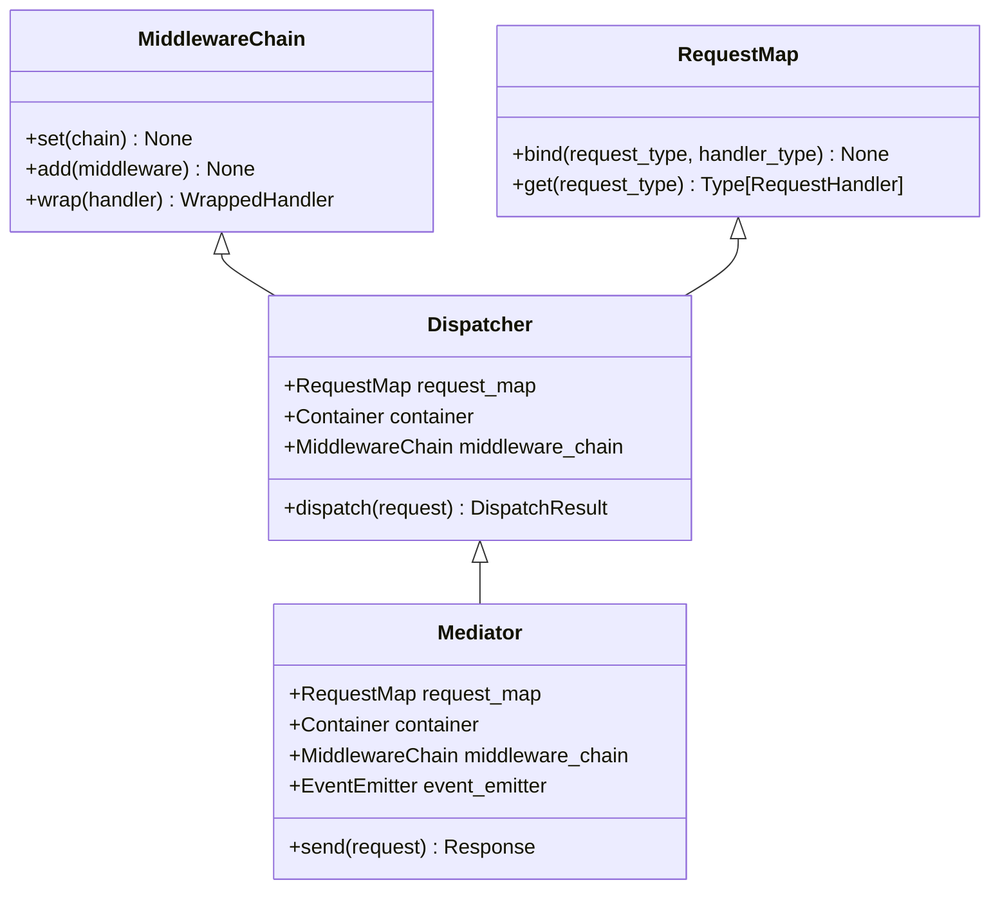
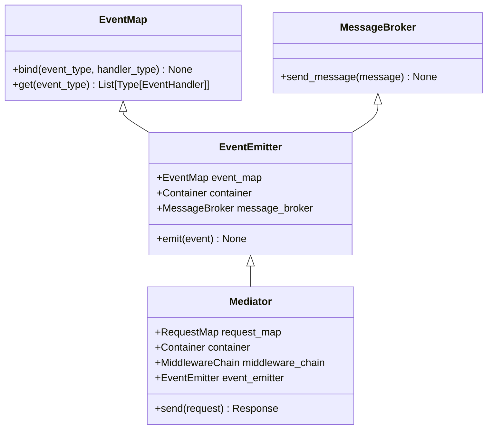
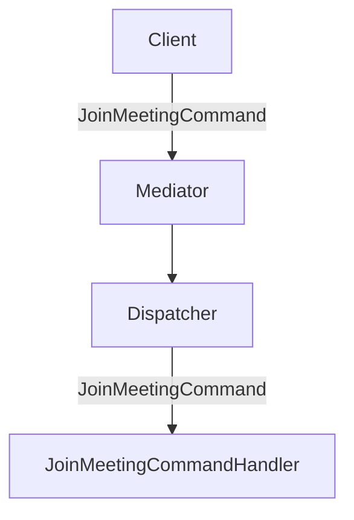
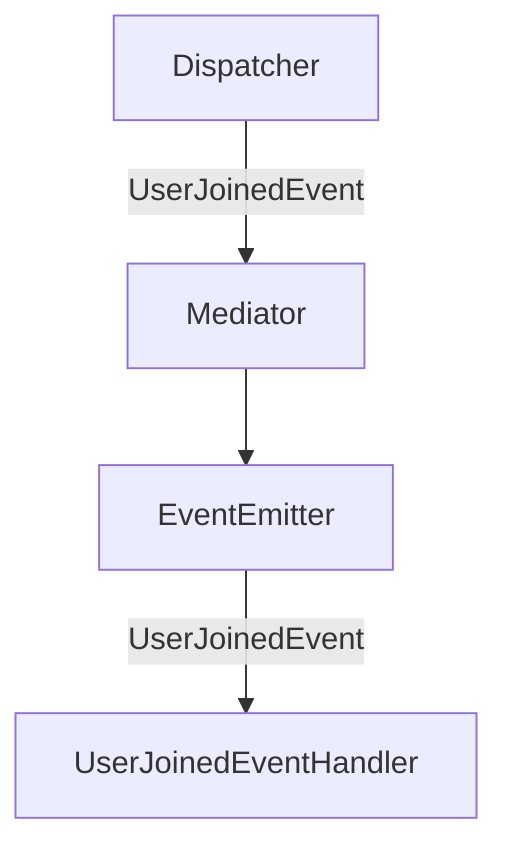

# Architecture

## Components

Structure of the library includes several components, such as:

- `Request`
- `RequestMap`
- `RequestHandler`
- `Response`
- `Event`
- `EventMap`
- `EventHandler`
- `MessageBroker`
- `EventEmitter`
- `Container`
- `Dispatcher`
- `Middleware`
- `MiddlewareChain`
- `Mediator`

## Components Dependency

### Request-related system side:

### Event-related system side:

## Components Interaction

### Request dispatching:

Description:

1. Client sends JoinMeetingCommand to Mediator.
2. Mediator sends this command to Dispatcher.
3. Dispatcher gets its handler and builds instance of command handler class via Container.
4. Dispatcher handles command using certain method of its handler.
5. Dispatcher returns DispatchResult to Mediator, which contains published events and Response.

### Event dispatching:

Description:

1. Dispatcher returns DispatchResult to Mediator, which contains published events and Response.
2. Mediator sends published event to EventEmitter.
3. Event gets its handler and builds instance of event handler class via Container.
4. EventEmitter handles command using certain method of its handler.
